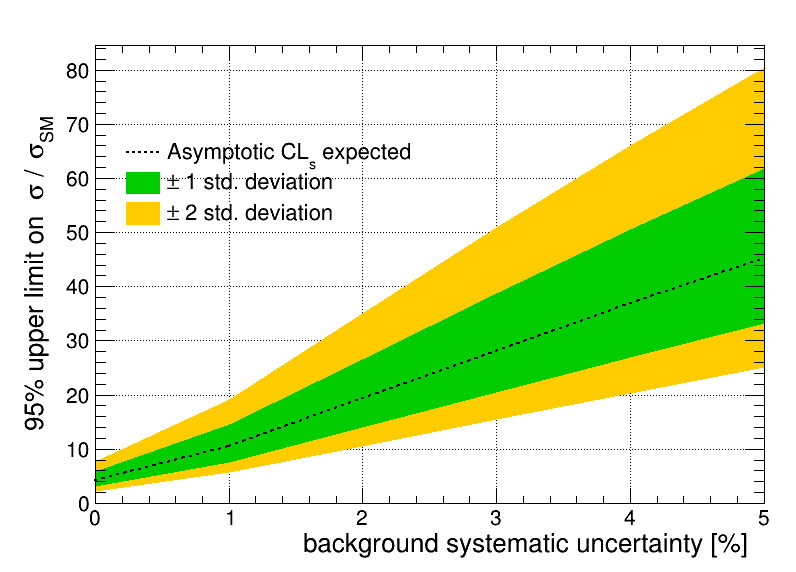

Combine
=======

[](https://travis-ci.com/guitargeek/combine)

## Introduction

This is a fork of the [HiggsAnalysis-CombinedLimit tool](https://github.com/cms-analysis/higgsanalysis-combinedlimit), developed by the CMS collaboration. The original tool is used by many analyses in the collaboration, not only in the Higgs sector. For more information how to use it, follow the documentation in the original repository.



This fork was done on the 23. March 2019 from the `81x-root606` branch at the commit with the hash `5cc169efd9233011924e5fbd468ef05be044ed39`. The goal was:

* Easy standalone complilation with __cmake__
* modernize the tool by consistently applying the C++ 17 standard and porting all Python code to Python 3
* make the code nicer by applying __clang-format__ on the C++ code and formatting the Python code with __black__

With version 1.0 of this fork, the code differs from the original only by the points listed above plus the removal of non-essantial files from the repository. It will be decided in the future if compatibility with the original will be kept or if the functionality will diverge to ensure a modern workflow, flexibility and ease of use.

After version 1.0, the goals shifted a bit and with be outlined in the following.

### Goals

## Installation

Combine consists of both Python and C++ code, which can be installed together as a python package. Please follow these steps for a clean installation:

1) Clone the repository recursively and change directory:
   ```bash
   git clone --recursive git@github.com:guitargeek/combine.git
   cd combine
   ```
2) Set the location of the header files at install time:
   ```bash
   export COMBINE_INCLUDE_DIR=$PWD/include
   ```
   Please copy the headerfiles somewhere else before and set the `COMBINE_INCLUDE_DIR` accordingly if you plan to delete or move the repository after the installation.
3) Installation of the package:
   ```bash
   pip install --user .
   ```

### Testing

### Requirements

Two unusual build and runtime requirements, which are usually not installed in the usual linux system are:
* The [ROOT framework](https://root.cern.ch/)
* [CERN VDT](https://github.com/drbenmorgan/vdt) for fast math

For Arch Linux, these requirements are provided by the official repositories in the [root](https://www.archlinux.org/packages/community/x86_64/root/) and [cern-vdt](https://www.archlinux.org/packages/community/x86_64/cern-vdt/) packages.

## Getting started

After installing the combine tool, you can test it by running the [Brazilian plot example](examples/brazilian_plots.py) to reproduce the plot at the top of this readme file. So far, this is the only supported example.

## For Developers

For development, one does not want to do the full installation because it would take too long to recompile and install everything with setuptools. Instead, it makes more sense to use cmake directly for the C++ code:

```bash
git clone --recursive git@github.com:guitargeek/combine.git
cd combine

mkdir build
cd build

cmake ..
make -j8

export COMBINE_LIB_DIR=$PWD/lib
export PYTHONPATH=$PYTHONDIR:$COMBINE_LIB_DIR
```

When the `COMBINE_LIB_DIR` is set, the Python package is now separated from the C++ library. The C++ code is now not always recompiled if you install the python package.

Note that this time you don't need to set the `COMBINE_INCLUDE_DIR` variable. When you use cmake directly, it will just use the headers from the include directory in the repository.

### Code formatting

To format the whole C++ code:
```
find include -regex '.*\.\(cpp\|hpp\|cc\|cxx\|hh\|hxx\|h\)' -exec clang-format -style=file -i {} \;
find src -regex '.*\.\(cpp\|hpp\|cc\|cxx\|hh\|hxx\|h\)' -exec clang-format -style=file -i {} \;
```

To format the whole Python code:
```
black --line-length 120 .
```
